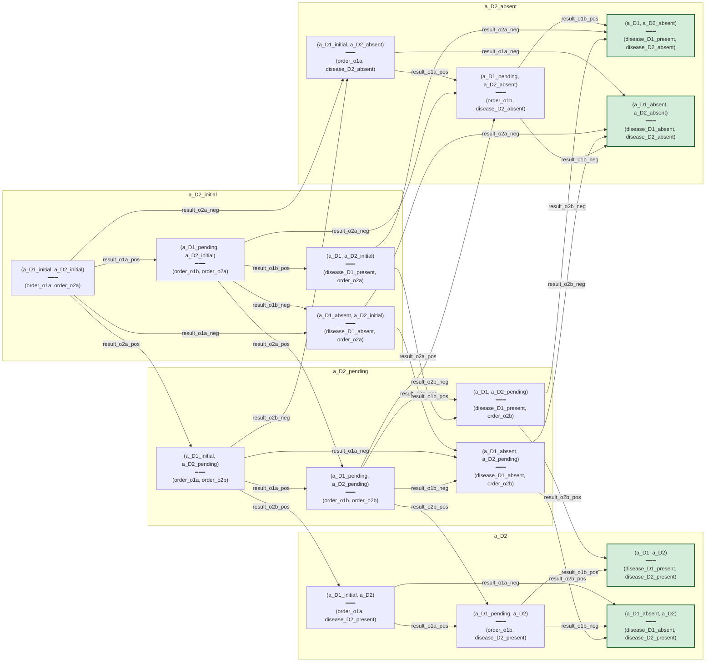

# V2 master-D (D_v2_toy) — transition structure

The V2 master bicomodule `D : O ⇸ P` for the D1/D2 toy. Each node is
a D-position (joint per-disease phenotype tuple) labeled with its
workup-state pointer (= recommendation under post-σ readout). Edges
are σ event firings drawn from `Σ_obs_v2`. Joint-terminal positions
(both diseases at `:a_Dk` or `:a_Dk_absent`) styled in green.

Grouped into Mermaid subgraphs by D2-state: each subgraph contains
the four D-positions sharing that D2 component, organizing the
4×4 grid visually. 16 D-positions, ~32 σ-event transitions.

