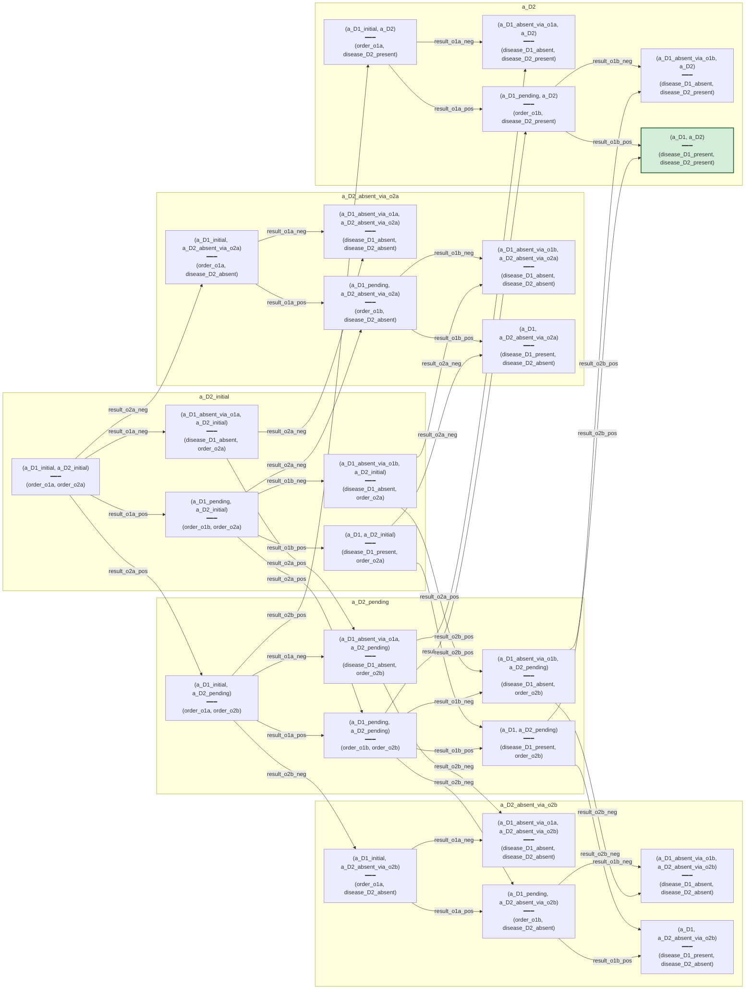

# V2 master-D (D_v2_compiled) — compiled from D1+D2 protocols

The Differential produced by `compile_protocol_v2` + `compose_differentials_2`
on the existing v1.x `D1_protocol` and `D2_protocol`. Distinct from
`D_v2_toy` — preserves the via_o1a/via_o1b distinction, giving 5
phenotypes per disease and 25 D-positions.

Grouped by D2-state. Larger graph than D_v2_toy; useful for
visualizing the full state space.

