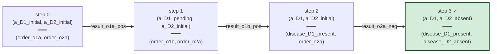

# V2 trajectory — Patient_D1, sequential mode

Simulator trace through `D_v2_toy` for `Patient_D1`. Each step shows
the D-position and joint workup state; edges are labeled with the σ
events fired during that transition.

