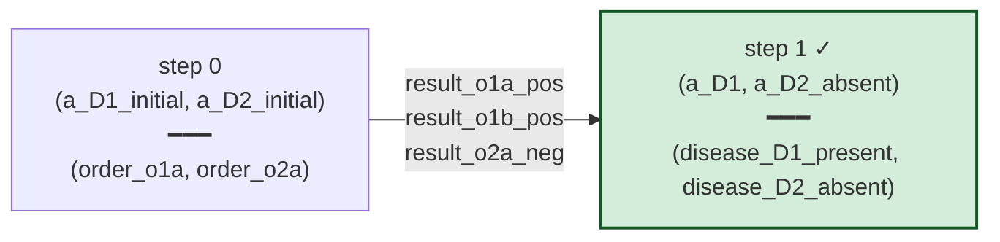

# V2 trajectory — Patient_D1, panel mode

Panel mode advances both non-terminal diseases per step; per-disease
panel + screen-positive fires confirm immediately (2 σ in one step).
The trajectory reaches the same final state as sequential, in fewer
steps.

