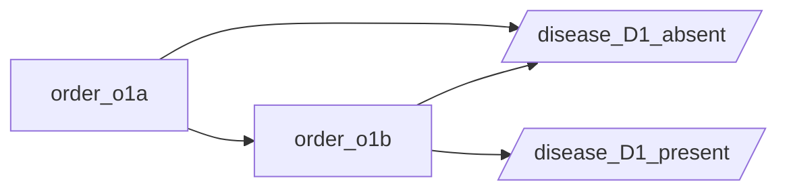

# Order graph — free-P for D1

The directed graph of the planned-pathway transitions. Order nodes are
rectangles; clinical-conclusion nodes (`disease_*_present`,
`disease_*_absent`) are parallelograms. Each edge is a free-P
generator; the bicomodule's `sharp_R` extends along these.

