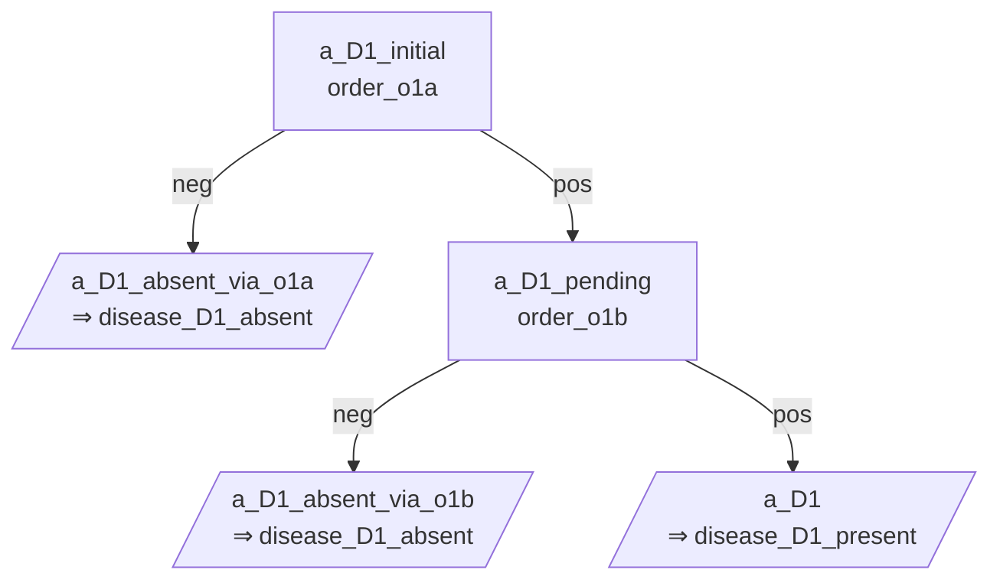
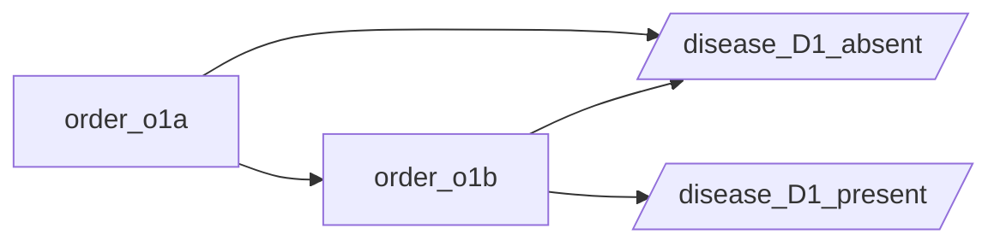

# Protocol D1 — overview

## Workflow

```mermaid
flowchart TD
    a_D1_initial["a_D1_initial<br/>order_o1a"]
    a_D1_absent_via_o1a[/"a_D1_absent_via_o1a<br/>⇒ disease_D1_absent"/]
    a_D1_pending["a_D1_pending<br/>order_o1b"]
    a_D1_absent_via_o1b[/"a_D1_absent_via_o1b<br/>⇒ disease_D1_absent"/]
    a_D1[/"a_D1<br/>⇒ disease_D1_present"/]

    a_D1_initial -->|neg| a_D1_absent_via_o1a
    a_D1_initial -->|pos| a_D1_pending
    a_D1_pending -->|neg| a_D1_absent_via_o1b
    a_D1_pending -->|pos| a_D1
```

## Free-P order graph

```mermaid
flowchart LR
    disease_D1_absent[/"disease_D1_absent"/]
    disease_D1_present[/"disease_D1_present"/]
    order_o1a["order_o1a"]
    order_o1b["order_o1b"]

    order_o1a --> disease_D1_absent
    order_o1a --> order_o1b
    order_o1b --> disease_D1_absent
    order_o1b --> disease_D1_present
```
